# autoencoder-quantization-images

## How to run

 In this submission we have two notebooks (one using GAN, one that does not use GAN).
 to run both of the notebooks there are two options:
1. run without loading the model’s weights
to do that, run each cell one after the other.
2. load our model’s weights
	to do that, uncomment the following code in the notebook and add the path to the model’s weights (the pt file which is included in the submission).

link to drive with the model's weights:
https://drive.google.com/drive/folders/1h40GaE0eTDAy_3pQM2mltNBQ7CM2L5uX?usp=sharing

# The problem


1. Take gray scale image with 255 gray scale level.
2. Quantized the image to low level of gray scale.
3. Restoring the quantized image to be as identical as possible to the original.


# Dataset - Flower-102

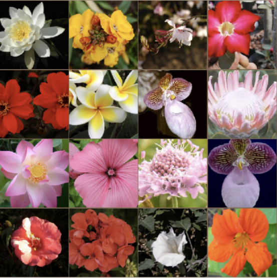

# Architecture

### Encoder

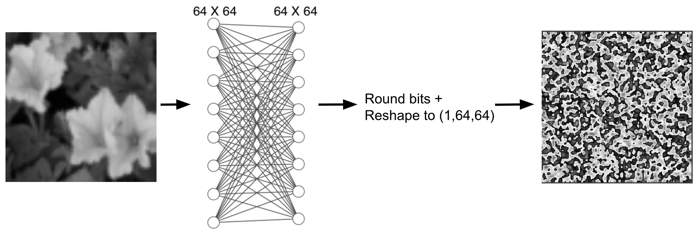

### Decoder

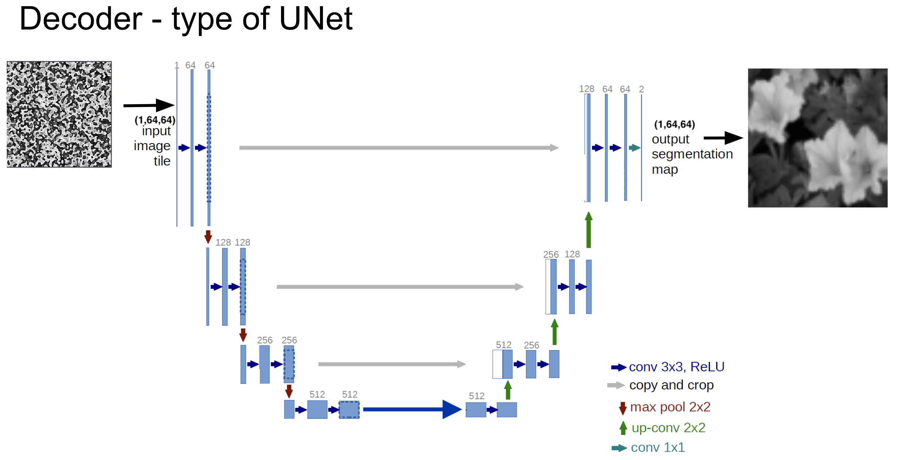

# Transforms

* We used random crop in order to increase the amount of our data.
* After that we resized it to fit our network, within the limits of our GPU we worked on 64x64 images.
* And we converted to gray scale image in shape (1,64,64).

```
transform = transforms.Compose([
    transforms.RandomCrop((256, 256)),
    transforms.Resize((64,64)),
    transforms.Grayscale(),
    transforms.ToTensor()
])
```

# Result

## AutoEncoder - only MSE loss

### Training Loss - AutoEncoder

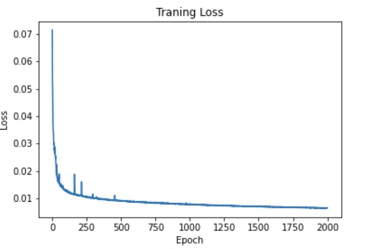

## Results

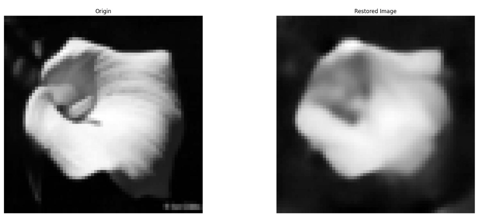
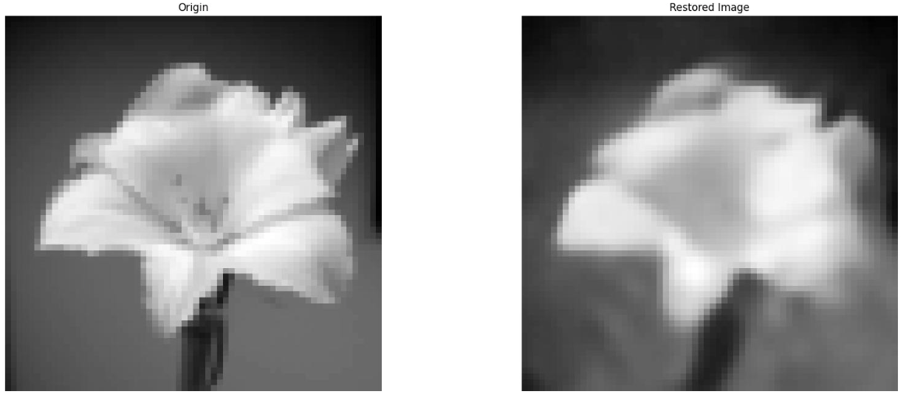
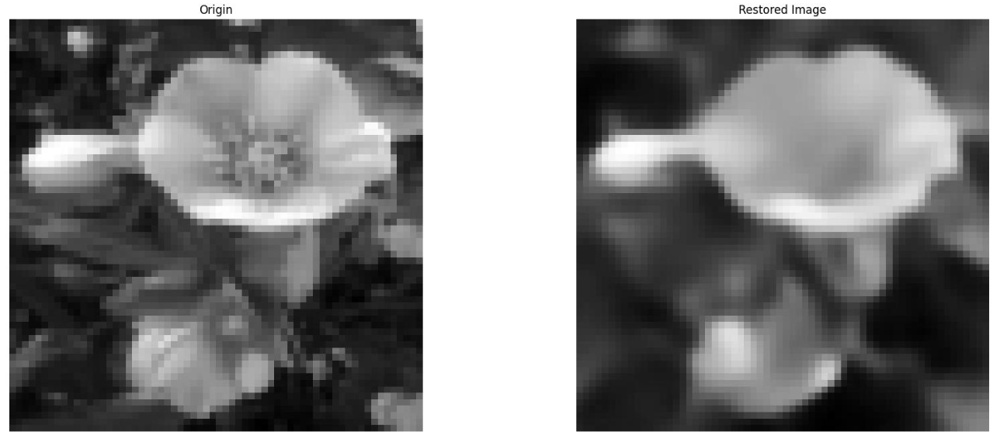
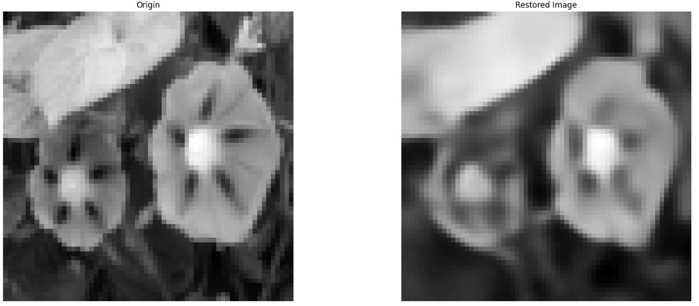

## GAN

* The Autoencoder Loss was a linear combination of an MSE Loss and a GAN loss which was calculated using the discriminator.
* In each epoch we trained the Autoencoder and the discriminator.

### Training Loss - Discriminator

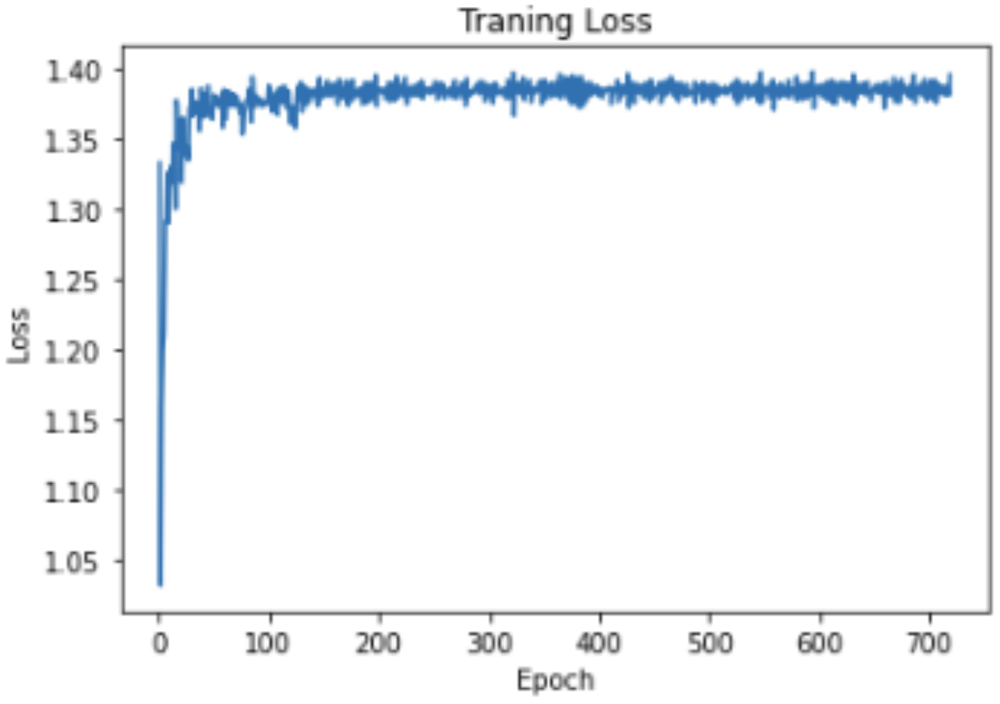


### Training Loss - AutoEncoder

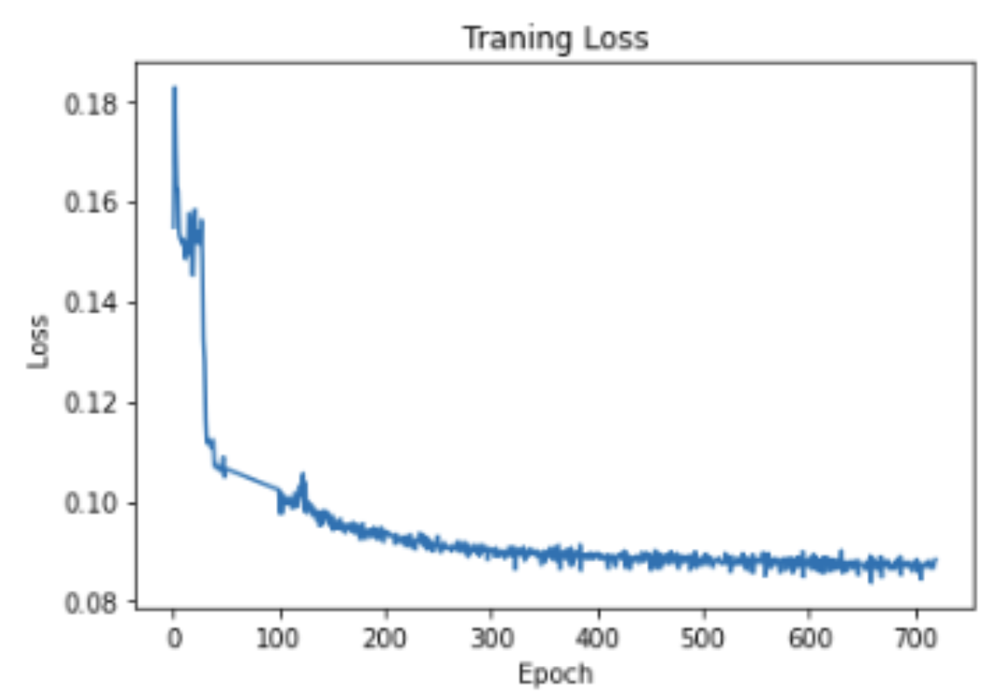

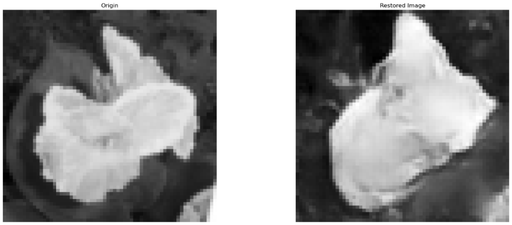
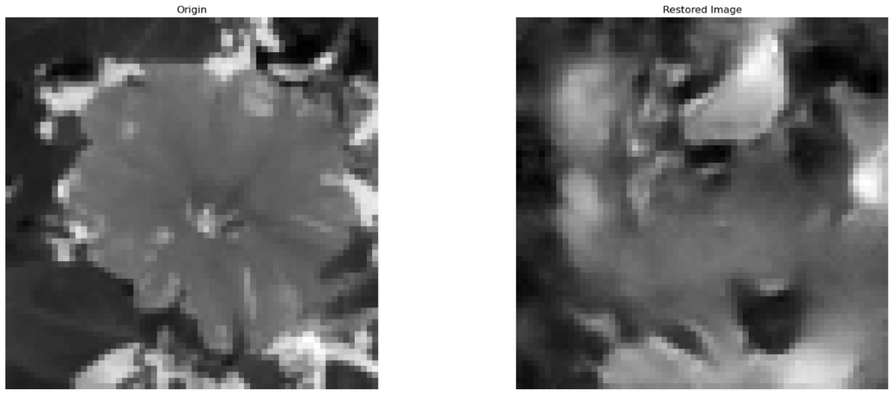
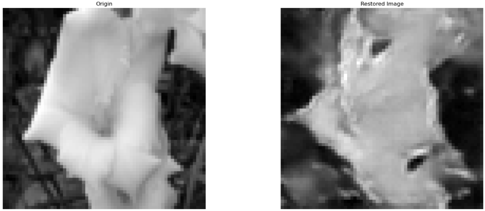


